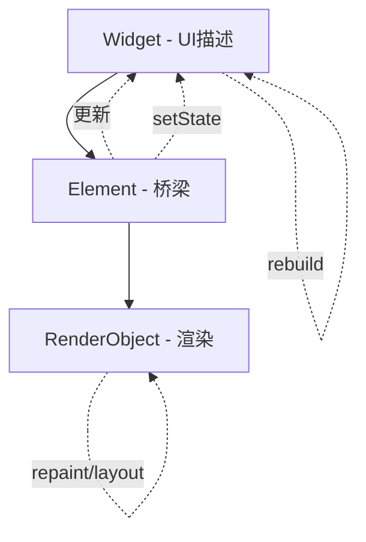

在 Flutter 中使用 `setState` 是最原始也最简单的状态管理方法，但也有很多**容易踩坑**的地方。以下是使用 `setState` 时需要注意的一些关键点，结合实例和解释，帮你避免常见问题。

---

## ✅ 一、只能在 `StatefulWidget` 中使用

`setState()` 只能在 `StatefulWidget` 的 `State` 类中使用。

### 错误示例

```dart
class MyWidget extends StatelessWidget {
  int count = 0;

  @override
  Widget build(BuildContext context) {
    return ElevatedButton(
      onPressed: () {
        count++;         // 无法更新 UI
        setState(() {}); // ❌ StatelessWidget 中没有 setState
      },
      child: Text('$count'),
    );
  }
}
```

---

## ✅ 二、避免在 `build()` 中调用 `setState()`

`build()` 是用来渲染 UI 的，不应该触发状态更新，否则可能导致死循环或性能问题。

### 错误示例

```dart
@override
Widget build(BuildContext context) {
  setState(() {}); // ❌ 不要在 build 中调用 setState
  return Text("Hello");
}
```

---

## ✅ 三、更新局部状态，避免重建整个树

使用 `setState` 会触发当前 widget 树下的 **整个 build 函数重建**。如果状态变化只影响一部分 UI，应尽可能拆分组件，减少无谓重建。

### 示例优化

```dart
// 父组件
class CounterPage extends StatefulWidget {
  @override
  _CounterPageState createState() => _CounterPageState();
}

class _CounterPageState extends State<CounterPage> {
  int count = 0;

  @override
  Widget build(BuildContext context) {
    return Column(
      children: [
        ElevatedButton(
          onPressed: () => setState(() => count++),
          child: Text("Increment"),
        ),
        CounterDisplay(count: count), // 👇 子组件，不会重建自身
      ],
    );
  }
}

// 子组件
class CounterDisplay extends StatelessWidget {
  final int count;
  const CounterDisplay({required this.count});

  @override
  Widget build(BuildContext context) {
    return Text("Count: $count");
  }
}
```

---

## ✅ 四、`setState()` 不是真的“修改值”，而是“触发重建”

`setState` 不会修改状态本身，而是通知 Flutter 状态已变，**你要手动修改变量值**。

### 示例

```dart
setState(() {
  counter++; // 你必须手动更新变量
});
```

---

## ✅ 五、避免在 `dispose()` 后调用 `setState()`

异步操作结束后调用 `setState()`，要确保当前 widget 仍然挂载（`mounted == true`），否则会报错：

```
setState() called after dispose()
```

### 正确写法

```dart
Future<void> loadData() async {
  final data = await fetchSomething();
  if (!mounted) return;
  setState(() {
    this.data = data;
  });
}
```

---

## ✅ 六、避免频繁调用 `setState`

高频调用（如在动画帧、滚动、秒表中）会导致性能问题。建议使用 `Ticker`, `AnimationController`, 或 `StreamBuilder` 等方式替代。

---

## ✅ 七、异步操作时正确使用 `setState`

不要把 `async` 加到 `setState()` 上！

### 错误写法

```dart
setState(() async {
  data = await fetchData();  // ❌ 异步不应该在 setState 中执行
});
```

### 正确写法

```dart
fetchData() async {
  final result = await getData();
  setState(() {
    data = result;
  });
}
```

---

## ✅ 八、使用 `setState` 时注意 UI 闪烁问题

`setState` 每次都会刷新 UI，如果不加判断，可能导致不必要的刷新。

### 优化写法

```dart
setState(() {
  if (count != newCount) {
    count = newCount;
  }
});
```

---

## 🔚 总结：`setState` 使用注意事项

| 事项   | 建议                                              |
| ---- | ----------------------------------------------- |
| 位置   | 仅用于 `StatefulWidget` 的 `State` 类                |
| 调用时机 | 不要在 `build()`、`dispose()` 后调用                   |
| 控制刷新 | 最小化 `setState` 范围，避免不必要的重建                      |
| 性能   | 高频更新避免使用，改用 `AnimatedBuilder`、`StreamBuilder` 等 |
| 异步处理 | 先 `await`，后 `setState`，并加上 `if (mounted)`       |

---

## setState 的底层原理

`setState()` 是 Flutter 中最基础的状态管理方法，它的底层原理其实并不复杂，但理解清楚它的 **触发机制、刷新原理与生命周期关系** 对写出高质量 Flutter 代码非常关键。

---

## 🧠 一句话原理总结

> `setState()` 的本质是：**通知 Flutter 框架当前 Widget 的状态发生了改变，应该重新调用 `build()` 方法进行 UI 重建。**

---

## 🧩 底层原理详细解析

### 1️⃣ `StatefulWidget` 和 `State` 是如何工作的？

当你创建一个 `StatefulWidget` 时：

```dart
class MyWidget extends StatefulWidget {
  @override
  _MyWidgetState createState() => _MyWidgetState();
}
```

Flutter 会：

* 创建 `MyWidget` 实例（Widget 是不可变的）
* 调用 `createState()`，创建一个可变的 `_MyWidgetState`
* **Flutter 框架持有的是 `State` 实例**，它是真正有生命周期的部分

---

### 2️⃣ 调用 `setState()` 会发生什么？

```dart
setState(() {
  // 修改本地状态变量
});
```

底层流程如下：

#### ✅ 第一步：标记该组件为 "dirty"

```dart
void setState(VoidCallback fn) {
  assert(_element != null);
  fn();  // 执行你的状态更新逻辑
  _element.markNeedsBuild();  // 标记需要重建
}
```

这里的 `_element` 是 `StatefulElement`，是 Flutter 框架中的一个核心类（继承自 `Element`）。

`markNeedsBuild()` 会：

* 把当前组件加入 Flutter 的 “dirty list”
* 等待下一帧进行批量更新（UI 重建）

---

### 3️⃣ 下一帧触发重建

Flutter 每帧都会检查是否有 "dirty" 组件：

* 如果有，就调用对应 `State` 的 `build()` 方法
* 用新的 Widget Tree 替换旧的 Widget Tree（差异对比后才真正重绘）

这是一种**惰性+批量优化机制**。

---

## ⚙️ Flutter 渲染管线与 `setState`

完整的渲染管线：

```
setState() → markNeedsBuild() → scheduleBuildFor() →
build() → element tree diff → renderObject 更新 → 屏幕刷新
```

这说明：

* **Widget 是临时的、不可变的**
* **Element 是桥梁，负责 diff 和 build**
* **RenderObject 是最终绘制层，才真正操作屏幕像素**

---

## 🧪 举例对比流程

```dart
class CounterWidget extends StatefulWidget {
  @override
  _CounterWidgetState createState() => _CounterWidgetState();
}

class _CounterWidgetState extends State<CounterWidget> {
  int count = 0;

  @override
  Widget build(BuildContext context) {
    print('build called');
    return Text('$count');
  }

  void increment() {
    setState(() {
      count++; // 改变局部状态
    });
  }
}
```

调用 `increment()` 时：

* `count++` 执行
* `setState()` 标记 dirty
* Flutter 在下一帧重建 `build()` → 打印 `"build called"`

---

## 🧭 为什么不要在 `build()` 中调用 `setState()`？

因为：

* `build()` 每帧都会被调用（只要有状态变动）
* 如果在里面调用 `setState()`，就会**无限触发重新 build**
* 导致 **死循环 + 性能爆炸**

---

## 🧱 内部类核心：`StatefulElement`

```dart
class StatefulElement extends ComponentElement {
  State state;

  void markNeedsBuild() {
    if (!_dirty) {
      _dirty = true;
      scheduleBuildFor(this);
    }
  }

  @override
  Widget build() => state.build(this);
}
```

Flutter 核心通过 `StatefulElement` 调用你的 `State.build()` 方法，连接了框架与业务逻辑。

---

## 🎯 总结重点

| 核心点             | 说明                                   |
| --------------- | ------------------------------------ |
| `setState()` 本质 | 标记 Widget 为 dirty，等待下一帧重建            |
| 谁触发 `build()`   | Flutter 调用 `StatefulElement.build()` |
| 何时不该用           | `build()` 中调用、`dispose()` 后调用        |
| 是否立即刷新          | 否，是**下一帧**                           |
| 可控粒度            | 不支持局部更新，整个 `build()` 重建              |

---

好的，下面是对 \*\*Flutter 的三层架构（Widget → Element → RenderObject）\*\*的结构图讲解和详细说明，帮助你深入理解 `setState()` 的底层机制。

---

## 🧱 Flutter 三层结构核心图解

```
╔═══════════════════════════╗
║        Widget（描述层）    ║ ← build() 返回的就是 Widget
╠═══════════════════════════╣
║  StatelessWidget / StatefulWidget 等  ║
║  描述 UI 结构，无状态、不可变         ║
╚═══════════════════════════╝
             ↓ 创建

╔═══════════════════════════╗
║         Element（桥梁层）  ║ ← 持久存在，管理生命周期 & 状态
╠═══════════════════════════╣
║  StatelessElement / StatefulElement  ║
║  持有 Widget & State 的引用           ║
║  执行 build() 构建子 Widget 树       ║
╚═══════════════════════════╝
             ↓ attach/renderObject

╔═══════════════════════════╗
║     RenderObject（渲染层）║ ← 真正控制布局、绘制、点击
╠═══════════════════════════╣
║  RenderBox、RenderFlex 等            ║
║  处理 layout、paint、hitTest 等渲染逻辑 ║
╚═══════════════════════════╝
```

---

## 🔄 三层之间的关系（动态流程）



* **Widget** 是短生命周期的，每次 `build()` 都新建
* **Element** 是连接状态和视图的“桥梁”，管理生命周期
* **RenderObject** 是长期存在的，真正控制 UI 渲染

---

## 🎯 `setState()` 穿越三层过程示意

```dart
setState(() {
  count++;  // 修改状态
});
```

发生了什么？

1. `State.setState()` 被调用
2. 内部调用 `_element.markNeedsBuild()`
3. Flutter 将 `Element` 标记为 dirty，加入 build 队列
4. 下一帧执行：调用 `build()` → 新 Widget 树
5. Flutter 比较新旧 Widget 树（Widget diff）
6. 如果发现 Widget 类型或属性变了 → 更新对应的 `RenderObject`

---

## ✅ 举个具体例子

```dart
class MyWidget extends StatefulWidget {
  @override
  State<MyWidget> createState() => _MyWidgetState();
}

class _MyWidgetState extends State<MyWidget> {
  int count = 0;

  @override
  Widget build(BuildContext context) {
    return Text("count: $count");
  }
}
```

1. 创建 `MyWidget` 时：

    * Widget → MyWidget
    * Element → StatefulElement
    * State → \_MyWidgetState
    * RenderObject → RenderParagraph（因为 `Text`）

2. 每次 `setState()` 时：

    * 只是重新执行 `build()`，生成新的 Widget（Text Widget）
    * Flutter 检查新旧 `Text Widget` → 如果数据变了，更新文字
    * 不重新创建 Element，不重建 RenderObject，只是更新其属性

---

## 📌 小贴士：什么时候会重建 Widget / Element / RenderObject？

| 改变内容            | Widget 重建 | Element 重建 | RenderObject 重建  |
| --------------- | --------- | ---------- | ---------------- |
| 属性变化（文本、颜色）     | ✅         | ❌          | ❌（只更新属性）         |
| Widget 类型变化     | ✅         | ✅          | ✅（换了渲染类型）        |
| `setState()` 调用 | ✅         | ❌          | ❌（除非 Widget 类型变） |

---

## 📷 总结一句话图解

```
用户写的 build() → 生成 Widget Tree
           ↓
setState() 触发 → 当前 Element 标记为 dirty
           ↓
下一帧执行 build → diff → 更新 RenderObject 属性或结构
```

---


非常好，深入理解 **Flutter 的性能优化机制**，关键就是理解它如何通过 **Widget diff 算法** 和 **渲染管线（Render Pipeline）** 来实现：

* **高效 UI 更新**
* **避免不必要的 rebuild/repaint/layout**

---

## 🧠 一句话总结：

> Flutter 借助 **immutable Widget + Element diff + RenderObject 最小更新**，实现了 React 样式的响应式 UI，又比 Web 更接近原生性能。

---

## 🧩 一、Flutter 的 Widget diff 算法（又称 Reconciliation）

Flutter 每次 `build()` 都会 **重新创建 Widget 树**，这看似“浪费”，但其实它借助 **diff 算法** 很聪明地做了优化。

### 🧱 Widget 是临时描述（不可变）

每次 `build()` 都会返回新 Widget 对象，但 Flutter 会：

* **比较新旧 Widget**
* 如果类型相同，只更新属性
* 如果类型不同，销毁旧 Element/RenderObject，创建新的

---

### 🧠 Diff 算法的核心逻辑（简化版）：

```dart
if (newWidget.runtimeType == oldWidget.runtimeType &&
    newWidget.key == oldWidget.key) {
  // ✅ 复用 Element/RenderObject，仅更新属性
} else {
  // ❌ 类型变了 → 销毁旧的，创建新的
}
```

---

### ✅ 举例对比：

#### 情况一：仅属性改变

```dart
Text('Hello') → Text('World')
```

* Widget 类型相同 → 复用 Element + RenderObject
* 只更新 RenderParagraph 的文本内容

#### 情况二：类型改变

```dart
Text('Hello') → Icon(Icons.add)
```

* 类型不一样 → 销毁 `Text` 的 Element/RenderObject，创建新的 `Icon` 渲染结构

---

## 🎯 Diff 高效的关键：`key`

如果你用 `ListView` 等组件，动态插入/删除/移动元素时：

* Flutter 不仅靠 `index` 匹配，还依赖 `key`
* `key` 能帮助 Flutter 正确地识别“哪个 Widget 是哪个”

### ⚠️ 没有 key 时的问题：

```dart
List<String> items = ['A', 'B', 'C'];

// 删除 B，列表变成 ['A', 'C']
```

* 没有 key → Flutter 以为 A→A, B→C（错误复用）
* 会导致 UI 逻辑错误、动画错位、状态异常

✅ **解决：使用 `ValueKey/UniqueKey`**

---

## 🧱 二、Flutter 渲染管线 Render Pipeline

完整流程如下：

```mermaid
flowchart TD
  A[Widgets] -->|build| B[Element Tree]
  B -->|diff| C[RenderObject Tree]
  C --> D[Layout]
  D --> E[Paint]
  E --> F[Compositing]
  F --> G[Rasterize (GPU)]
```

---

### 每一层的职责：

| 阶段           | 描述                                |
| ------------ | --------------------------------- |
| Widget       | UI 声明，构建 UI 树                     |
| Element      | 持久节点，负责 build 和 diff 逻辑           |
| RenderObject | 实际布局 & 绘制对象，继承 RenderBox          |
| Layout       | 测量 & 安排位置（如 `constraints`、`size`） |
| Paint        | 将 UI 绘制指令写入 `Layer` 树（并不会立即绘制）    |
| Compositing  | 将不同 layer 合成，优化合成过程（如缓存、硬件加速）     |
| Rasterize    | 将 Layer 转为像素图，由 Skia 引擎提交 GPU     |

---

## ⏱️ 三、性能优化重点点拨

| 技术点                   | 意义与作用                              |
| --------------------- | ---------------------------------- |
| `const` Widget        | 避免重复 build，提升构建性能                  |
| 合理使用 `key`            | 减少 diff 误判，提升重排效率                  |
| `shouldRebuild` 控制    | 避免不必要 rebuild，例如 `AnimatedBuilder` |
| `RepaintBoundary`     | 创建隔离区域，防止重绘扩散                      |
| 分离 widget             | 减少 `setState` 影响范围                 |
| 使用 `ListView.builder` | 延迟构建 item，提升大列表性能                  |

---

## 📌 小结：Flutter 高性能的核心秘诀

| 秘诀              | 说明               |
| --------------- | ---------------- |
| Widget 不可变      | 易于比较，diff 高效     |
| Element 长驻内存    | 持久对象，减少创建销毁开销    |
| RenderObject 重用 | 类型一致不重建，只更新属性    |
| 分帧渲染机制          | 每帧只更新变化区域，GPU 高效 |
| Layer 合成优化      | 避免全屏绘制，支持局部缓存    |

---

## 🧪 想要实战中验证 diff 效果？

你可以在 `build()` 中打 log：

```dart
@override
Widget build(BuildContext context) {
  print('build called');
  return Text("value");
}
```

或使用 `Flutter DevTools → Timeline → Frame chart` 看每帧 build/repaint/layout 开销。

---
